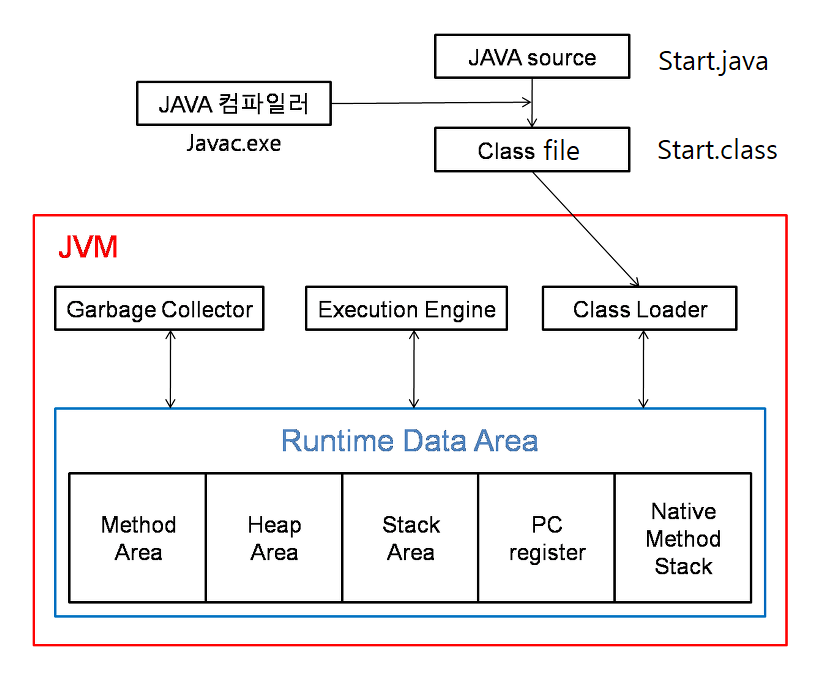

# 자바 언어를 알아보기

### 참조 자료 링크
+ [Oracle Java](https://www.oracle.com/kr/java/)
+ [OpenJDK](https://jdk.java.net/archive/)
+ [Eclipse](https://www.eclipse.org/)
+ [Spring Tools](https://spring.io/tools)
+ [Visual Studio Code](https://code.visualstudio.com/docs/java/java-tutorial)

### 위키백과 자료 링크
+ [PP (Programming Paradigm)](https://ko.wikipedia.org/wiki/%ED%94%84%EB%A1%9C%EA%B7%B8%EB%9E%98%EB%B0%8D_%ED%8C%A8%EB%9F%AC%EB%8B%A4%EC%9E%84)
+ [OOP (Object-Oriented Programming)](https://ko.wikipedia.org/wiki/%EA%B0%9D%EC%B2%B4_%EC%A7%80%ED%96%A5_%ED%94%84%EB%A1%9C%EA%B7%B8%EB%9E%98%EB%B0%8D)
+ [JAVA](https://ko.wikipedia.org/wiki/%EC%9E%90%EB%B0%94_(%EC%86%8C%ED%94%84%ED%8A%B8%EC%9B%A8%EC%96%B4_%ED%94%8C%EB%9E%AB%ED%8F%BC))

### 주요 학습 언어 특성
+ 프로그래밍 패러다임(programming paradigm) 중 객체지향 프로그래밍 (Class 기반)
+ 객체지향 프로그래밍은 독립된 단위, 즉 "객체"들의 모임을 뜻한다.
+ 객체(Object)란 저장공간에 할당되어 값을 가지거나 식별자에 의해 참조되는 공간 (변수, 자료 구조, 매소드(함수))

---

### java 파일 사용법 4가지 조건
+ 클래스(`class`)당 파일(`file`) 1개
+ 파일명과 클래스명은 동일해야한다. (`대소문자 구분`)
+ 클래스명은 항상 첫번째 글자는 대문자로 사용한다. `(Test "O", test "X")`
+ 항상 작성하는 코드는 `클래스` 속에 만들다. 단, 외부 코드나 package는 밖에 있을 수 있다.

### 프로그램 시작은?
+ main 매소드 (함수)가 존재 해야 한다.
+ main 매소드가 규칙이 있고 형태는 아래와 같다.
+ main 매소드명은 변경이 불가하다.
+ main 매소드 실행 시 입력 받은 변수가 존재 해야 한다.

### 프로그램 동작은 어디서 하나요?
+ Java 프로그램은 운영체제에서 동작하는 `JVM`에서 동작한다.
+ JVM(자바 가상 머신)은 Java 프로그램을 `바이트 코드`로 실행 할수 있도록 구현한 도구
+ JVM은 모든 운영체제에 설치 실행이 가능하다.

### JVM(Java Virtual Machine)
+ `Class Loader` : "Test.java -> Test.class" 파일를 JVM이 운영체제에게 할당받은 메모리영역에 생성하는 역할를 한다. 
+ `Execution Engine` : 메모리영역에 생성된 클래스를 기계어로 변경해 명령어 단위로 실행하는 역할를 한다.
+ `Garbage Collector` : Heap 메모리 영역에 생성된 객체들 중 참조되지 않는 객체들을 탐색 후 제거하는 역할를 한다.
+ `Runtime Data Area` : JVM 메모리 영역으로 자바 애플리케이션을 실행할 때 사용되는 데이터들을 생성하는 영역이다.

</img>

## Runtime Data Area

### Method area (메소드 영역)
```
클래스 멤버 변수의 이름, 데이터 타입, 접근 제어자 정보같은 필드 정보와 메소드의 이름, 리턴 타입, 파라미터, 
접근 제어자 정보같은 메소드 정보, Type정보(Interface인지 class인지), Constant Pool(상수 풀 : 문자 상수, 
타입, 필드, 객체 참조가 저장됨), static 변수, final class 변수등이 생성되는 영역이다.
```

### Heap area (힙 영역)
```
new 키워드로 생성된 객체와 배열이 생성되는 영역이다.
메소드 영역에 로드된 클래스만 생성이 가능하며, Garbage Collector가 참조되지 않는 메모리를 확인하고 제거하는 
영역이다.
```

### Stack area (스택 영역)
```
지역 변수, 파라미터, 리턴 값, 연산에 사용되는 임시 값등이 생성되는 영역이다.
메소드를 호출할 때마다 개별적으로 스택이 생성된다.
클래스 생성 시 스택 영역에 생성된 "s"가 힙 영역에 생성된 객체를 가리키고(참조하고) 있는 것이다.
아래의 코드와 같이 생성되는 영역을 말한다.
```

### PC Register (PC 레지스터)
```
Thread(쓰레드)가 생성될 때마다 생성되는 영역으로 Program Counter 
즉, 현재 쓰레드가 실행되는 부분의 주소와 명령을 저장하고 있는 영역이다. (*CPU의 레지스터와 다름)
이것을 이용해서 쓰레드를 돌아가면서 수행할 수 있게 한다.
```

### Native method stack
```
자바 외 언어로 작성된 네이티브 코드를 위한 메모리 영역이다.
보통 C/C++등의 코드를 수행하기 위한 스택이다. (JNI)
```
